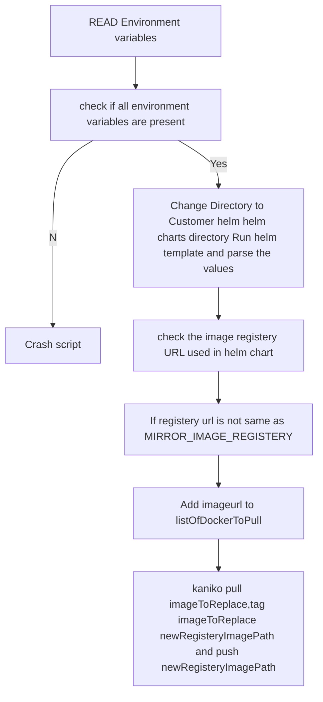

# ImageMirrorScript

## Workflow

- CI will export the following environment variables
    1. MIRROR_IMAGE_REGISTERY 
    2. MIRROR_REGISTERY_TOKEN

- CI Will run ImageMirrorScript
- Script will upload images to KUBEAID_IMAGE_REGISTERY and MIRROR_IMAGE_REGISTERY and replace the old image urls from helm chart. 
- CI ends

## Architecture 

