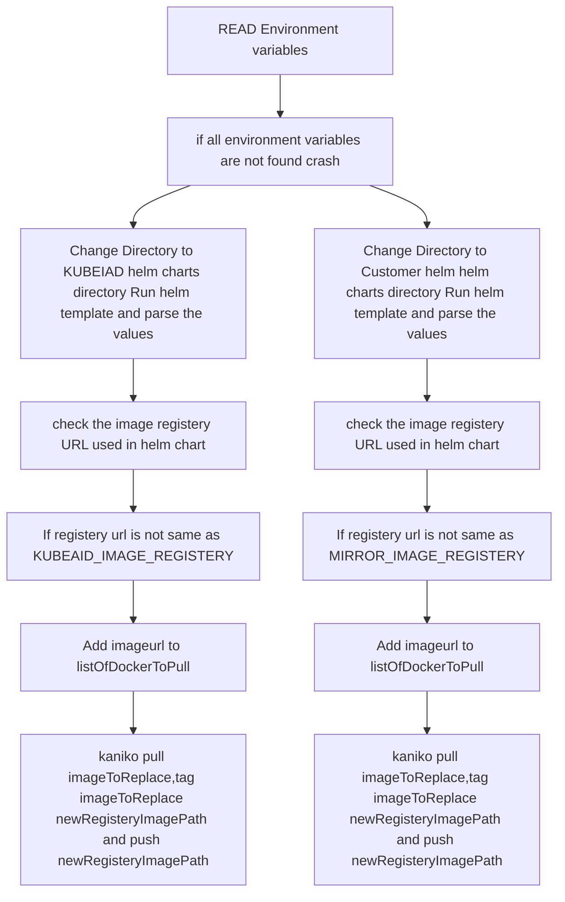

# ImageMirrorScript

## Workflow

- CI will export the following environment variables
    1. KUBEAID_IMAGE_REGISTERY 
    2. KUBEAID_REGISTERY_TOKEN
    3. MIRROR_IMAGE_REGISTERY 
    4. MIRROR_REGISTERY_TOKEN
    5. OLD_KUBEAID_IMAGE_REGISTERY
    6. OLD_KUBEAID_REGISTERY_TOKEN
    7. OLD_MIRROR_IMAGE_REGISTERY
    8. OLD_MIRROR_REGISTERY_TOKEN

- CI Will run ImageMirrorScript
- Script will upload images to KUBEAID_IMAGE_REGISTERY and MIRROR_IMAGE_REGISTERY and replace the old image urls from helm chart. 
- CI ends

## Architecture 

