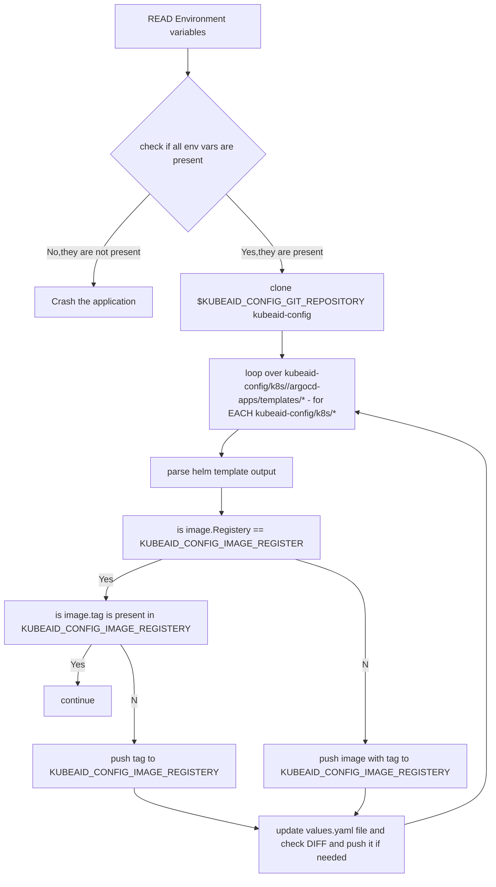

# OCIImageMirror

- A CI automation to mirror public images to private image-repository's 

## Nomenclature 
1. MIRROR_GIT_REPOSITORY = Mirror of kubeaids on customer side
2. KUBEAID_CONFIG_GIT_REPOSITORY = customers-kube-config

An example of Nomenclature:
> MIRROR_GIT_REPOSITORY= github.com/Kilroy/kubeaids 
> KUBEAID_CONFIG_GIT_REPOSITORY=https://gitea.obmondo.com/EnableIT/kubernetes-config-enableit

## CI variables
CI will export the following environment variables:
1. KUBEAID_CONFIG_IMAGE_REGISTERY 
2. KUBEAID_CONFIG_REGISTERY_TOKEN
3. KUBEAID_CONFIG_GIT_REPOSITORY
4. KUBEAID_CONFIG_GIT_REPOSITORY_TOKEN

### Helm templating example command

- `helm template myrelease argocd-helm-charts/<chartneme> --values argocd-helm-charts/<chartneme>/values.yaml --values kubeaid-config/k8s/az1.kilroy.eu/argocd-apps/<chartname>-values.yaml`

## Architecture 

